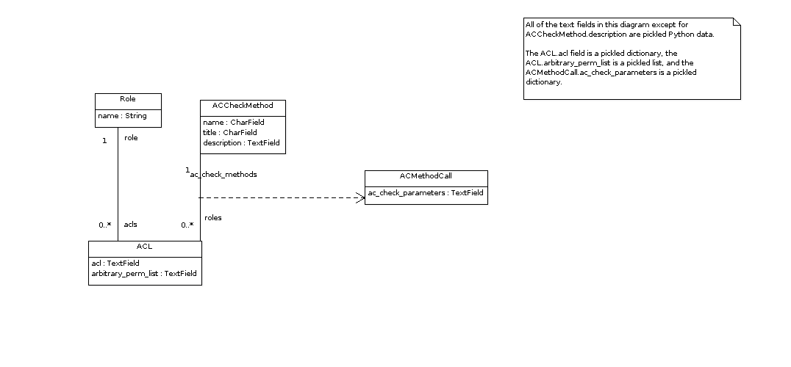

.. _datamodel-acls:

==============================
Roles and Access Control Lists
==============================

The majority of the code directly related to users is
located in the ``pr_services.models`` and
``pr_services.authorizer`` modules.  Initialization
of the roles and ACLs for a given variant is typically
done by its initial setup module, which extends
``pr_services.initial_setup.InitialSetupMachine``.

Variants often
subclass the ``pr_services.authorizer`` module to provide
additional methods for determining whether a role applies
to a user in a given circumstance.

