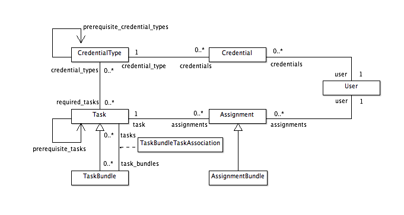

.. _datamodel-credentials:

===========
Credentials
===========

.. seealso:: Subsystems :ref:`subsystems-task-and-credential-management`

UML
===

Model Details
=============

.. module:: pr_services.models

.. class:: CredentialType

   A :class:`CredentialType` is a template for a :class:`Credential`.
   Every :class:`Credential` is of a :class:`CredentialType`, and
   can be thought of as a specific instantiation of a
   :class:`CredentialType`.  This way, comparison of Credentials is
   easy to do.

   .. attribute:: id

      Primary key (int)

   .. attribute:: name

      Name of the credential type (CharField, max length 255, non-null, non-empty, unique).

   .. attribute:: description

      Description of the credential (TextField, may be null).

   .. attribute:: required_tasks

      These are the tasks that the user must complete in order to be granted a
      credential of this type.  Currently, all of them must be done, but
      we could have a more complicated rule system in the future.
      (ManyToManyField with the :class:`Task <pr_services.models.Task>` model)

   .. attribute:: prerequisite_credential_types

      These are other :class:`CredentialTypes <CredentialType>` that are prerequisites to granting
      this one.  Currently all of them must be satisfied, but we could have a more
      complicated rule system in the future.
      (Reflexive ManyToManyField, not symmetrical)

.. class:: Credential

   A :class:`Credential` is an instance of a :class:`CredentialType` and is always
   associated with a :class:`User <pr_services.models.User>`.

   .. attribute:: credential_type

      Foreign key reference to a credential type.  Required.  Related name is 'credentials'.

   .. attribute:: authority

      Name of the authority who granted the :class:`Credential`.  (CharField, max
      length 255, may be null).

   .. attribute:: serial_number

      The ID of the credential given by the authority. (CharField, max length 255, may be null).

   .. attribute:: user

      Foreign key reference to the user whose credential this is.  May not be null,
      related name is 'credentials'.

   .. attribute:: date_granted

      The date the user was assigned the burden of attempting this credential.
      It is the same time as the creation event of the credential object.
      (DateTimeField, auto_now=True, null=False)

      .. note::

         This description was taken straight from the comment about the attribute in the
         model definition, but doesn't make much sense to me.  This gets set
         explicitly by the mark_granted() method, which is called by the
         check_requirements_for_completion() method if all of the requirements for
         this credential have been met.  See Redmine #2773.

   .. attribute:: date_completed

      The date the credential status was set to 'granted'. (DateTimeField, may be null)

   .. attribute:: date_expires

      Optional expiration date for the credential. (DateTimefield, null=True)

   .. attribute:: date_started

      The date that the user began woring on gaining the credential. (DateTimeField, null=True)

   .. attribute:: status

      Status of the credential.  CharField with the following choices (may not be null):

      granted
          the user has earned the credential

      revoked
          the credential has been revoked

      pending
          the user is in the process of earning the credential

      expired
          the credential has (automatically) expired

   .. method:: check_requirements_for_completion()

      This method checks to make sure that credentials of all the required
      credential types have been granted to the user and that the user
      has completed assignments for all of the required tasks.  If not,
      it returns.  If so, it marks the credential as granted by calling
      the :meth:`mark_granted()` method.

   .. method:: mark_granted()

      This method marks the credential as granted and sets the completion
      date.

      .. note::

         This sets the date_granted field but not the date_completed field.
         See Redmine #2773.

