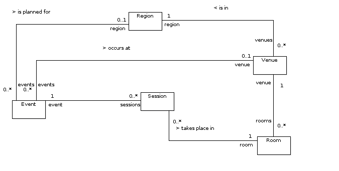

.. _datamodel-events_and_sessions:

===================
Events and Sessions
===================

The most fundamental model of a block of time in the Power Reg
system is the session.  Events are merely containers that contain
zero or more sessions, and each session must have a corresponding
event.  The following UML diagram elucidates the relationships
among events, sessions and related classes:

