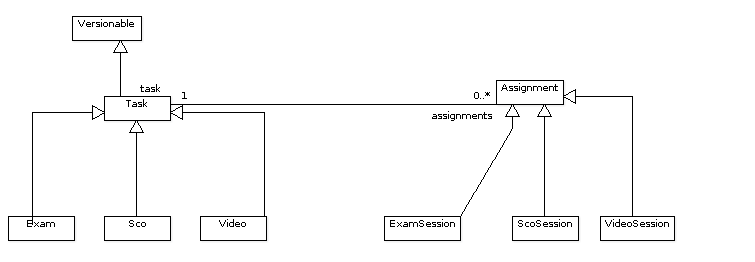

.. _datamodel-tasks_and_assignments:

=====================
Tasks and Assignments
=====================

.. seealso:: Subsystems :ref:`subsystems-task-and-credential-management`

Like other systems implementing Learning Management System (LMS)
functionalities, PowerReg tracks tasks and users' progress in
completing them.  Specific task types (such as ``Exam`` or
``Video``) are all represented as subclasses of the
``pr_services.model.Task`` model.  Likewise, specific types
of assignments are subclasses of the ``pr_services.models.Assignment``
model.  Every assignment refers to exactly one task.

.. note::

   The choice of the two terms "task" and "assignment" as they
   are used in the data model is a bit unfortunate, as in regular
   English usage they mean just about the same thing.  In our
   data model, however, they do *not* mean the same thing.
   PowerReg tasks represent something that could be assigned
   to a user (e.g. a SCORM course, a video that can be watched, etc.),
   but there is never an actual association made in the
   database between a :class:`Task <pr_services.models.Task>` and a
   :class:`User <pr_services.models.User>` that
   represents assignment of a task to a user.  That function
   is performed by the :class:`Assignment <pr_services.models.Assignment>` model.

Tasks may be bundled together in containers called task bundles,
which are modelled by the :class:`Task Bundle <pr_services.models.TaskBundle`
class, which is explained more thoroughly later in this document, in the
:ref:`datamodel-tasks_and_assignments-task_bundles` section.

The majority of the code related to tasks and assignments is
located in the ``pr_services.models`` module and the
``pr_services.credential_system`` package.

.. module:: pr_services.models

.. class:: Task

   The :class:`Task` model is used as a template for assignments.

   .. attribute:: id

      The primary key (int).

   .. attribute:: description

      Long description of the task (TextField).

   .. attribute:: name

      Name for the task (CharField, max length 255).

   .. attribute:: version_id

      Numeric version for the task (PositiveIntegerField, may be None).

   .. attribute:: version_label

      A unique label for the version id (used to store things like Mercurial
      changeset id's, dates, Subversion tag names, etc.).  CharField, max length 255.

   .. attribute:: version_comment

      Optional comment to describe the version (used to store things like
      commit log messages for items taken from a version control system).
      CharField, max length 255.

   .. attribute:: prerequisite_tasks

      This is a recursive many-to-many field that represents the tasks that
      must be completed before this one may be attempted.  This is not
      a symmetric many-to-many field, because of its directional nature -- just
      because task A is required to attempt task B doesn't make that task
      B is required to attempt task A.

   .. attribute:: public

      Whether this task is publically viewable (boolean field).

   .. attribute:: published

      Whether this task is published (typically means available for assignment).
      Boolean field.

   .. attribute:: rejected

      Whether this task has been rejected by a reviewer.

.. note::

   It's a bit awkward to have both a published and a rejected field on the :class:`Task`
   model.  We should probably at least validate that a task is not both published
   and rejected.  A status field would probably work better.  See Redmine #2774.

.. class:: Assignment

   An assignment is an instance of a user's attempt to do a :class:`Task`.

   .. attribute:: user

      Foreign-key reference to the user in question.  Related name is 'assignments'.
      May be null, which represents an anonymous action.

   .. attribute:: task

      Foreign-key reference to the :class:`Task` that this assignment is for.
      May not be null.

   .. attribute:: status

      Represents whether the user has completed the task, with several possible values:

      completed
          the user has completed the assignment

      pending
          the user has begun but not completed the assignment

      assigned
          the user has not begun the assignment

      late
          the user did not complete assignment before deadline

      withdrawn
          user was withdrawn from assignment

      canceled
          the assignment has been canceled

   .. attribute:: date_completed

      The date when the user completed the assignment (DateTimeField, null=True)       

   .. attribute:: date_started

      The date when the user began the assignment (DateTimeField, null=False)

      .. note::

         For SCD, it doesn't make sense that this field can't be null.
         If another user assigns a task to a user, but the user hasn't
         actually done any work on the assignment, this should be null.
         See Redmine #2776.

   .. attribute:: due_date

      When the assignment is due (DateTimeField, null=True).  Null means no
      due date.

   .. attribute:: effective_date_assigned

      The effective date assigned is the date that is planned for the User to
      begin the assignment (DateTimeField, null=True).

      .. note::

         The create_timestamp field would generally correspond to when the
         assignment was actually made.

   .. attribute:: authority

      Name of the authority who deems that the assignment has been completed.
      (CharField, max length 255, null=True)

   .. attribute:: serial_number

      The identifier of the assignment given by the authority named in the
      :attr:`authority` attribute.  (CharField, max length 255, null=True)

   .. method:: mark_completed()

      This method is a helper method that is used to mark this :class:`Assignment`
      as completed.  It sets the completion date to now and the status to "completed".
      It also notifies any :class:`pr_services.models.Credential` objects that
      are waiting on the task to be completed, in case the user is eligible for
      any credentials.

      .. note::

         This could be done in an overridden save() method instead.

.. _datamodel-tasks_and_assignments-task_bundles:

Task Bundles
============

A task bundle is an ordered collection of tasks.  In order to store
the order of the associated tasks in the database, a many-to-many relationship
between the :class:`TaskBundle <pr_services.models.TaskBundle>` and
:class:`Task <pr_services.models.Task>` classes was established with
an association class (aka through table),
:class:`TaskBundleTaskAssociation <pr_services.models.TaskBundleTaskAssociation>`.

.. class:: TaskBundle

   An ordered collection of :class:`tasks <pr_services.models.Task>`.  This
   is a subclass of the abstract model base class
   :class:`Versionable <pr_services.models.Versionable>`.

   superclasses: :class:`OwnedPRModel <pr_services.models.OwnedPRModel>`,
   :class:`Versionable <pr_services.models.Versionable>`

   .. attribute:: tasks

      This is the many-to-many field that associates tasks with task bundles,
      via the association class
      :class:`TaskBundleTaskAssociation <pr_services.models.TaskBundleTaskAssociation>`
      (ManyToManyField, to = :class:`Task <pr_services.models.Task>`,
      through = :class:`TaskBundleTaskAssociation <pr_services.models.TaskBundleTaskAssociation>`).

   .. attribute:: name

      The name of this task bundle.  (CharField, may not be blank,
      max length 255, must be unique when taken
      together with the :attr:`version_id` and :attr:`version_label` attributes)

   .. attribute:: description

      Description of the task bundle.  (TextField, may be blank)

.. class:: TaskBundleTaskAssociation

   Association class, used to order the :class:`tasks <pr_services.models.Task>`
   associated with a :class:`task bundle <pr_services.models.TaskBundle>`.

   superclass: :class:`PRModel <pr_services.models.PRModel>`

   .. attribute:: task

      Foreign-key reference to the :class:`Task <pr_services.models.Task>`

   .. attribute:: task_bundle

      Foreign-key reference to the :class:`TaskBundle <pr_services.models.TaskBundle>`

   .. attribute:: presentation_order
      
      Order in which to present this task to users (relative to the other
      tasks in the same task bundle).  The constraints on this are
      intentionally lax.  Equal values of presentation_order with the same
      task bundle but different tasks are permitted, and they signify that
      the corresponding two tasks can go in any order relative to each
      other.  However, lesser values for presentation_order mean that their
      corresponding tasks are presented first.  For example,
      0 1 1 2 3 4 5 5 5 might the presentation_order values for a correctly
      order set of tasks associated with a task bundle.

