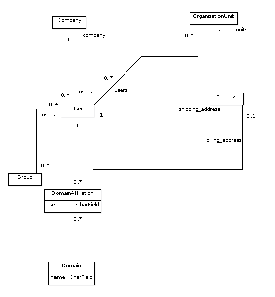

.. _datamodel-users:

==================================================
Users, Addresses, Groups, and Organizational Units
==================================================

We do not use the Django auth app's User model, for a
number of reasons, including:

 * We require somewhat lax requirements on usernames --
   spaces inside of them are permitted, they may
   contain any valid UTF-8 characters, and they can
   be fairly long.  The Django auth.User model does
   not permit spaces or non-alphanumeric characters.
 * We require the concept of user domains or realms, which
   does not exist in the auth.User model.

We may consider patching the auth.User model to meet
our needs in a future release of PowerReg core in order
to make integration with third-party Django apps
easier, as they typically refer to the auth.User model
explicitly.

Addresses are associated with users via to foreign key
references to the Address model in the User model, one
for the shipping address and one for the billing address.
This does not appear to be the most common
technique for aggregation in Django-managed
database models -- instead a foreign key reference from the
Address model to the User model or a generic foreign
key reference from the Address model to any other
Django model would be employed.  The current
design makes using the Django admin interface for
viewing and editing a user's addresses difficult.

We allow for integration with other systems for authentication
and retrieving data about users.  Generally a user's
domain is used to determine how to authenticate that user.
If a login is attempted for a user in some domains, such
as those that employ LDAP for retrieving user information,
users may be automatically created in the database on
the first successful login attempt.  Subsequent logins
with usually cause some data about the user to be fetched
from LDAP and updated in the database if necessary.
Variants typically subclass ``pr_services.user_system.UserManager``
as necessary to support the relevant integration needs
of the customer.  A simple method of storing password hashes
(with salts) in the database is implemented as well, generally
for the domain called 'local' or ''.

The majority of the code directly related to users is
located in the ``pr_services.models`` module and the
``pr_services.user_system`` package.

.. module:: pr_services.models

.. class:: User

   .. attribute:: id

      The primary key (int).

.. class:: Domain

   .. attribute:: id

      The primary key (int).

   .. attribute:: name

      The name of the domain, stored as a :class:`CharField <django.models.CharField>`, with
      max_length 255.  Required.

   .. attribute:: authentication_ip

      The IP address of the authentication agent.  Stored as a :class:`IPAddressField <django.models.IPAddressField>`,
      may be None.

   .. attribute:: authentication_password_hash

      A cryptographic hash of the authentication agent password.

   .. attribute:: password_hash_type

      Which algorithm was used to compute the :attr:`authentication_password_hash`.

.. class:: DomainAffiliation

   Association class for the many-to-many relationship between :class:`User` and :class:`Domain`.

   .. attribute:: id

      The primary key (int).

   .. attribute:: username

      The username of the :class:`User` in this :attr:`domain`.

   .. attribute:: domain

      A :class:`foreign key reference <django.models.ForeignKey>` to the :class:`Domain` associated
      with the :attr:`user`.

   .. attribute:: user

      A :class:`foreign key reference <django.models.ForeignKey>` to the :class:`User` associated
      with the :attr:`domain`.

.. class:: Group

   A group of users.  These are typically used to defined system roles.  For example,
   in most variants an administrator is a member of the ``Super Administrators`` group.

   .. attribute:: id

      The primary key (int).

   .. attribute:: name

      The name of the group, stored as a :class:`CharField <django.models.CharField>`, with
      max_length 255.  Required.

   .. attribute:: users

      All of the users in this group.  An end of the many-to-many relationship between
      :class:`User` and :class:`Group`.

.. class:: Address

   An idealized address, intended to support addresses from every country.

   .. attribute:: id

      The primary key (int).

   .. attribute:: country

      A two-letter ISO 3166 country code, see http://www.iso.org/iso/english_country_names_and_code_elements
      for a list of possible values.

   .. attribute:: region

      Typically a state or province name, stored as a :class:`CharField <django.models.CharField>`
      with max_length 31.  May be blank or null.

   .. attribute:: locality

      Typically a city or town name, stored as a :class:`CharField <django.models.CharField>`
      with max_length 31.  May be blank or null.

   .. attribute:: postal_code

      A postal code (zip code in the U.S.).  Stored as a :class:`CharField <django.models.CharField>`
      with max_length 16.  May be blank or null.

   .. attribute:: label

      This is a :class:`CharField <django.models.CharField>` of max_length 255 intended for
      storing what is typically called the street address in the U.S.  It may contain
      newline characters.  Required.
   
    
