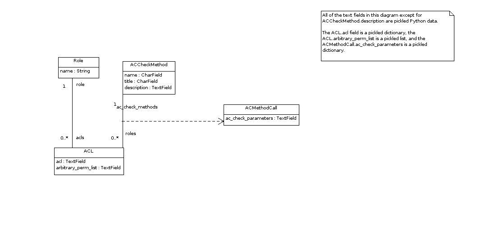

.. _subsystems-authorizer:

==============
The Authorizer
==============

This is documentation for the authorization system in the PowerU software
product. There is decent documentation on the code itself, but this document
offers a higher level view of the operation of the system. The purpose of
the authorization system is to analyze each request that comes to PowerReg
and decide to allow the request, partially allow the request, or deny the
request altogether. It offers attribute-level control on the models in
the system, based on a list of rules.

This documentation was written against revision 5134 of the PowerReg core backend.

Models
======

The models for the authorization system live in pr_services/models.py. The models
that pertain to the auth system are ``Role``, ``ACL``, ``ACCheckMethod``, and
``ACMethodCall``. The ``Role`` model represents what a human would typically
think of as a system role. The ``Role`` model has only two notable attributes:
a name and a list of ``ACL`` objects (we'll get to those in a second). For example,
if you were to have an instructor role in the system, you might create a ``Role``
object named "Instructor" with a list of ACLs that define what it is to be an
instructor, as well as what an instructor can do.

Let's talk about those ACLs. The ``ACL`` model contains the Access Control List
(ACL), but it also contains a mapping of rules to define when that list of access
controls should be applied to a particular call. It has a many-to-many relationship
with the ``ACCheckMethod`` model through the ``ACMethodCall`` model (we'll get to
these in a bit). It also specifies which role it is part of, the details of the
allowances of the acl (pickled, in the acl attribute), and a list of arbitrary
permissions (also pickled, we'll talk about those in a bit too).

The ``acl`` attribute contains a pickled dictionary, describing what types of
operations are permitted by the ACL on each type of object in the system, *if the
ACCheckMethods all pass*. For some examples of what this structure looks like,
have a look at ``pr_services/initial_setup.py``. If you look at the
``create_admin_role()`` method in there, you will see an example ACL. This structure
defines CRUD permissions for each object in the system. Anything not explicitly granted
is forbidden. For each object listed in an acl, you can define whether an object can
be created or deleted by defining a key 'c' or 'd', indexing a boolean. You can define
the attributes than can be read or updated by defining the keys 'r' and 'u', indexing
lists of strings of the attribute names desired.

The list of arbitrary permissions is simply a pickled list of strings. It is possible
to check to see if an actor has these permissions by asking the Authorizer for them by name.

The ``ACCheckMethod`` model is very simple. It has a name, a title, and a description.
The name and description are meant to be human readable in the hopes that one day
there might be a GUI that allows the end user to edit ACLs. For now, they are put in
the database via setup scripts and other, low-level scripts as needed.
The name of the ``ACCheckMethod`` must be the name of a method on the Authorizer class
(which may be on a subclass of the ``Authorizer`` class declared in the
facade as ``facade.subsystems.Authorizer``). Think of it as representing an
Authorizer method itself, in the database. The Authorizer's check methods can do anything
you like, from checking to see if a user is an instructor of a student, to checking to see
if the moon is full before giving permissions to do X, Y, and Z.

``ACCheckMethod`` objects are useless if you can't pass them parameters, which is why there is a
through table connecting it with the ACL model. The through table is called ``ACMethodCall``,
and has an attribute called ac_check_parameters, which is a pickled Python dictionary of
keyword parameters to be passed to the ACCheckMethod.

Let's illustrate how all this works by an example. Suppose you want to define an
Administrator role in your system. First, define an ACL dictionary, similar to the one
done in ``create_admin_role()`` in ``pr_services/initial_setup.py``. We're going to
create a ``Role`` object, named "Administrator". We are going to define that a person
is acting as an Administrator if and only if they are a member of the Administrator group.
Fortunately, there is already written an ``ACCheckMethod`` called
``actor_member_of_group()``, that takes a parameter for the group_id in question.
Let's create an ``ACL`` object with the pickled ACL dictionary. Then make an
``ACMethodCall`` linked to that ``ACL`` and the appropriate ``ACCheckMethod``
instance for the ``actor_member_of_group`` method, with a pickled dictionary
indexing the primary key of the Administrator group with a key "group_id". 
