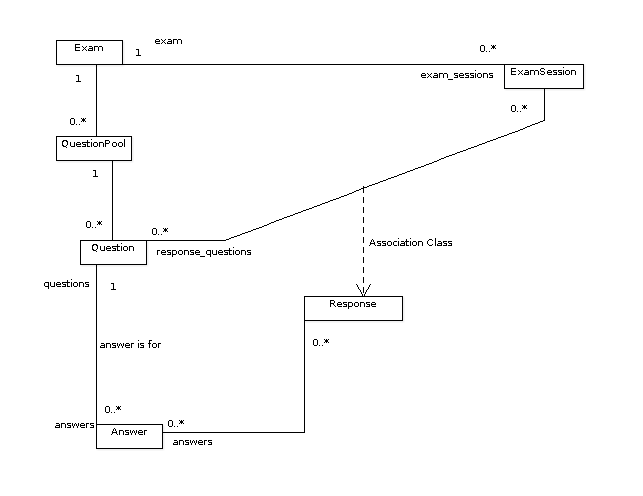

.. _subsystems-exams:

==================
The Exam Subsystem
==================

The exam subsystem can be used for most anything that resembles
an exam, quiz, or survey in structure.  It's not in its
second incarnation in yorktown.  The original exam subsystem was
created all the way back in the days of eBay Korea and is still
in place in ranger and earlier backends.

The old exam system used to support only multiple choice questions
and numeric ratings, which were modeled in the ``Question``
and ``Rating`` models.  The current system supports several
question types, including a ``rating`` question type, which
removes the need for a separate ``Rating`` model.

The following UML diagram shows the various models involved
in the current system:

Exams consist of an ordered list of question pools, with
the ordering being specified by the ``QuestionPool.order``
attribute.  Each question pool has an ordered list of 
questions (via the ``Question.order`` attribute), and
each question has an ordered list of answers (via
the ``Answer.order`` attribute).

.. note::

   In an effort to move us closer to having several Django apps rather
   than more-or-less one gigantic one, the models pertaining to the
   exam system in in the :mod:`pr_services.exam_system.models` module,
   which is currently imported wholesale into the :mod:`pr_services.models`
   module.

   Additionally, all of the models which were once defined directly in the
   :mod:`pr_services.models` module are now defined in the
   :mod:`pr_services.pr_models` module and imported into the
   :mod:`pr_services.models` module.

Models
======

.. module:: pr_services.exam_system.models

.. class:: Exam

   Represents an exam, survey, or quiz.  This is a child of the :class:`pr_services.models.Task` model.

   .. attribute:: id

      The primary key (int).

   .. attribute:: name

      A unique identifier for the exam (CharField with max_length 255, required).  In
      XML representations of exams, this is represented by an ``id`` attribute of an
      ``exam`` element.  Because it's represented as an XML ``id`` attribute, it must
      not be the same as any other ``name`` attribute for instances of the :class:`Exam` model,
      the :class:`QuestionPool` model, the :class:`Question` model, or the
      :class:`Answer` model.

   .. attribute:: title

      The exam's title (CharField with max_length 191, not required).

   .. attribute:: passing_score

      Minimum score required to pass the exam (PositiveIntegerField between 0 and 100 inclusive, defaults to 0).

.. class:: QuestionPool

   Represents a collection of questions.  These are ordered according to the :attr:`order` attribute.

   .. attribute:: id

      The primary key (int).

   .. attribute:: name

      A unique identifier for the question pool (CharField with max_length 255, not required).
      In XML representations of exams, this is represented by an ``id`` attribute of a
      ``questionpool`` element.  Because it's represented as an XML ``id`` attribute, it must
      not be the same as any other ``name`` attribute for instances of the :class:`Exam` model,
      the :class:`QuestionPool` model, the :class:`Question` model, or the
      :class:`Answer` model.

   .. attribute:: exam

      Reference to the exam containing this question pool.

   .. attribute:: title

      The question pool's title (CharField with max_length 191, not required).

   .. attribute:: order

      The position of this question pool, relative to all of the question pools in
      the same exam.  Stored as a :class:`PositiveIntegerField <django.models.PositiveIntegerField>`.
      If not specified on object creation, the new object is inserted at the end of the
      current sequence.

   .. attribute:: next_question_pool

      The position of this question pool, relative to all of the question pools in
      the same exam.  Stored as a :class:`PositiveIntegerField <django.models.PositiveIntegerField>`.
      If not specified on object creation, the new object is inserted at the end of the
      current sequence.

.. class:: Question

   The question model provides the information to display a question and
   determine whether the response is valid, regardless of whether or not it
   is considered a correct answer.

   .. attribute:: id

      The primary key (int).

   .. attribute:: name

      A unique identifier for the question (CharField with max_length 255, not required).
      In XML representations of exams, this is represented by an ``id`` attribute of a
      ``question`` element.  Because it's represented as an XML ``id`` attribute, it must
      not be the same as any other ``name`` attribute for instances of the :class:`Exam` model,
      the :class:`QuestionPool` model, the :class:`Question` model, or the
      :class:`Answer` model.

   .. attribute:: question_pool

      Reference to the question pool containing this question.

   .. attribute:: order

      The position of this question, relative to all of the questions in
      the same question pool.  Stored as a :class:`PositiveIntegerField <django.models.PositiveIntegerField>`.
      If not specified on object creation, the new object is inserted at the end of the
      current sequence.

   .. attribute:: required

      Is the user required to answer this question? (bool)

   .. attribute:: label

      Text presented to prompt the user, stored as a :class:`TextField <django.models.TextField>`,
      which can be really, really long if needed.  Required.

   .. attribute:: help_text

      Additional text to display to the user to help clarify how to answer the question.  This
      should probably always be displayed.  Stored as a :class:`TextField <django.models.TextField>`.
      Not required.

   .. attribute:: rejoinder

      A message to display to the user if they get the question wrong.  Stored as a
      :class:`TextField <django.models.TextField>`. Not required.

   .. attribute:: question_type

      The type of question, which roughly corresponds to a data type for the response.
      Possible values include:
      
      * bool - a question with a boolean response
      * char - a question with a string response (no more than 255 characters)
      * choice - a multiple-choice or multiple multiple-choice question
      * date - a question with a date response
      * datetime - a question with a combined date/time response
      * decimal - a question with a decimal response (fixed point, 24 total digits, 10 after the decimal point)
      * float - a question with a floating-point response
      * int - a question with an integer response
      * rating - a rating (integer, between :attr:`min_value` and :attr:`max_value` (currently unknown how to
        indicate N/A)
      * text - a textual response, possibly very long (the :attr:`max_length` attribute can be used
        to limit how long a response can be)
      * time - a question with a specific time as an answer (string response must be of one of the
        following formats (e.g. military time, with or without seconds): '%H:%M:%S', '%H:%M')

   .. attribute:: widget

      Widget used as a suggestion to the frontend on how to display this question.
      These choices correspond to the available Django form widgets.
      Possible values include:

      * CheckboxInput
      * CheckboxSelectMultiple
      * DateInput
      * DateTimeInput
      * RadioSelect
      * Select
      * SelectMultiple
      * Textarea
      * TextInput
      * TimeInput

   .. attribute:: min_value

      Minimum value for numeric questions (fixed point-decimal, 24 digits total, 10 after the decimal
      point), defaults to None.

   .. attribute:: max_value

      Maximum value for numeric questions (fixed point-decimal, 24 digits total, 10 after the decimal
      point), defaults to None.

   .. attribute:: min_length

      The minimum length of a textual response permitted.  Stored as a
      :class:`PositiveIntegerField <django.models.PositiveIntegerField>`, defaults to 0.

   .. attribute:: max_length

      The maximum length of a textual response permitted.  Stored as a
      :class:`PositiveIntegerField <django.models.PositiveIntegerField>`, defaults to None.

   .. attribute:: min_answers

      For a multiple-choice question (that is, a :class:`Question` with the ``choice``
      type, the minimum number of answers that must be chosen by the person answering
      the question.  Stored as a
      :class:`PositiveIntegerField <django.models.PositiveIntegerField>`, defaults to 1.

   .. attribute:: max_answers

      For a multiple-choice question (that is, a :class:`Question` with the ``choice``
      type, the maximum number of answers that must be chosen by the person answering
      the question.  Stored as a
      :class:`PositiveIntegerField <django.models.PositiveIntegerField>`, defaults to None.
      In the corresponding XML format for exams, None is represented by the string "none"
      for the ``max_answers`` attribute of the ``question`` element.

   .. attribute:: text_regex

      A regular expression used to validate textual responses to the question.  Stored as
      a :class:`CharField <django.models.CharField>`, defaults to None.  Regular
      expressions here should be expressed in a format accepted by the Python :mod:`re` module.

   .. attribute:: text_response

      For a question that is not of the ``char`` or ``text`` type, whether to allow the
      user to give an additional text response string.  Stored as a
      :class:`PRBooleanField <pr_services.models.PRBooleanField>`, defaults to ``False``.

   .. attribute:: text_response_label

      The text to prompt the user for the additional textual response if :attr:`text_response`
      is ``True`` or the user chooses an :class:`Answer` with :attr:`Answer.text_response` set
      to ``True``.

.. class:: Answer

   A possible answer to a question.

   The answer model provides possible choices for multiple choice questions,
   as well as logic used to determine whether the answer is correct for any
   question type.

   .. attribute:: id

      The primary key (int).

   .. attribute:: name

      A unique identifier for the answer (CharField with max_length 255, not required).
      In XML representations of exams, this is represented by an ``id`` attribute of an
      ``answer`` element.  Because it's represented as an XML ``id`` attribute, it must
      not be the same as any other ``name`` attribute for instances of the :class:`Exam` model,
      the :class:`QuestionPool` model, the :class:`Question` model, or the
      :class:`Answer` model.

   .. attribute:: question

      Reference to the question containing this answer.

   .. attribute:: order

      The position of this answer, relative to all of the answers for the same
      question.  Stored as a :class:`PositiveIntegerField <django.models.PositiveIntegerField>`.
      If not specified on object creation, the new object is inserted at the end of the
      current sequence.

   .. attribute:: label

      The text presented to the user for this answer.  Answers with no label
      are never sent to the user, only used to determine whether a response is
      correct.  Stored as a :class:`CharField <django.models.CharField>` that
      defaults to ``None``.

   .. attribute:: text_response

      If this answer is selected, whether to allow the user to give an additional text
      response string.  Stored as a :class:`PRBooleanField <pr_services.models.PRBooleanField>`,
      defaults to ``False``.

   .. attribute:: value

      The actual value or expression represented by this answer.  Used to
      determine whether the answer is correct when not a choice question. Stored
      as a :class:`CharField <django.models.CharField>` that defaults to ``None``.

   .. attribute:: correct

      ``True`` if this answer is a correct one, ``False`` if it is incorrect,
      ``None`` if it is neither correct nor incorrect.  Stored as a
      :class:`NullBooleanField <django.models.NullBooleanField>` that defaults
      to ``None``.

   .. attribute:: next_question_pool

      When set, determines the next question pool when this answer is selected,
      regardless of whether the answer is correct or not.  Defaults to ``None``.

   .. attribute:: end_question_pool

       When ``True`` and this answer is selected, immediately end the question pool.
       Defaults to ``False``.

   .. attribute:: end_exam

      When ``True`` and this answer is selected, end the exam after this question
      pool.  Defaults to ``False``.

.. class:: ExamSession

   An instance of a user taking an exam.  This is a child of the
   :class:`pr_services.models.Assignment` model.

   .. attribute:: exam

      Reference to the exam being taken.

   .. attribute:: score

      Percentage of questions for which there is a correct answer which were
      answered correctly, to 2 decimal places.

   .. attribute:: passed

      Whether the user passed the exam, ``None`` if the exam is not complete.

   .. automethod:: iter_questions

   .. automethod:: get_next_questions

   .. automethod:: submit_response

   .. automethod:: calculate_score

.. class:: Response

   The response model stores a response to a question, or a potential
   response to a question sent to the user but not yet answered.  A valid
   response is any response that passes all of the validation rules defined
   for the question itself, while a correct response is one that matches one
   or more of the correct answers associated with the question.

   .. attribute:: exam_session

      The exam session associated with this response.

   .. attribute:: question

      The question associated with this response.

   .. attribute:: valid

      Whether this response is valid, ``None`` if we haven't checked yet.

   .. attribute:: correct

      Whether this response is correct, ``None`` if we havent' checked yet.

   .. attribute:: value

      A property to get/set the response value based on the question type,
      instead of accessing the ``*_value`` fields directly.

   .. attribute:: text

      A property to get/set the free text response value.

XML Format
==========

The following Relax-NG schema specifies the format to use for XML files representing
exams:

.. literalinclude:: ../../../pr_services/exam_system/exam_schema.xml
   :language: xml

RPC Interface
=============

.. module:: pr_services.exam_system.exam_manager

.. autoclass:: pr_services.exam_system.exam_manager.ExamManager
   :members:
   :undoc-members:
   :inherited-members:
   :show-inheritance:

.. module:: pr_services.exam_system.question_pool_manager

.. autoclass:: pr_services.exam_system.question_pool_manager.QuestionPoolManager
   :members:
   :undoc-members:
   :inherited-members:
   :show-inheritance:

.. module:: pr_services.exam_system.question_manager

.. autoclass:: pr_services.exam_system.question_manager.QuestionManager
   :members:
   :undoc-members:
   :inherited-members:
   :show-inheritance:

.. module:: pr_services.exam_system.answer_manager

.. autoclass:: pr_services.exam_system.answer_manager.AnswerManager
   :members:
   :undoc-members:
   :inherited-members:
   :show-inheritance:

.. module:: pr_services.exam_system.exam_session_manager

.. autoclass:: pr_services.exam_system.exam_session_manager.ExamSessionManager
   :members:
   :undoc-members:
   :inherited-members:
   :show-inheritance:

.. module:: pr_services.exam_system.response_manager

.. autoclass:: pr_services.exam_system.response_manager.ResponseManager
   :members:
   :undoc-members:
   :inherited-members:
   :show-inheritance:

Exceptions
==========

.. automodule:: pr_services.exam_system.exceptions
   :members:
